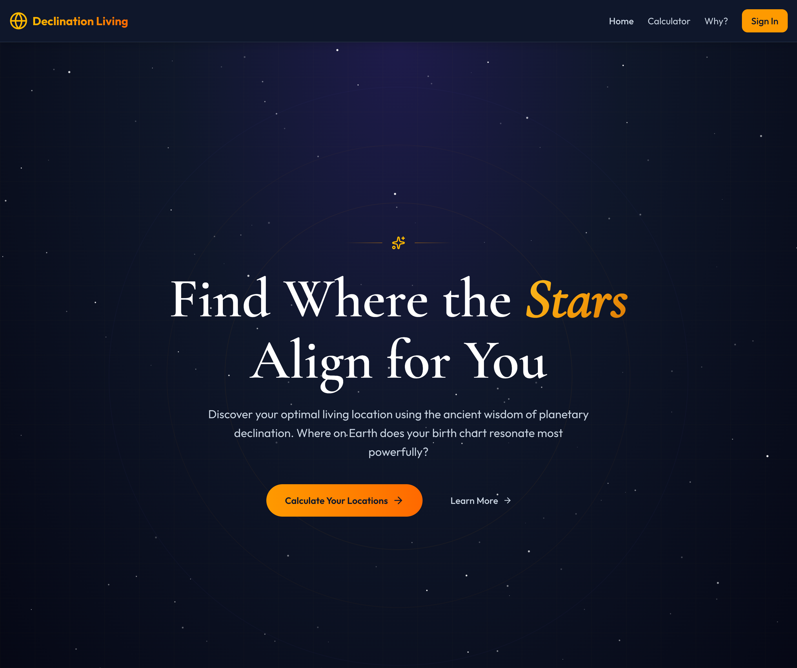

# Declination Living

**Find where the stars align for you.** Declination Living is an astrology-based location finder that uses planetary declinations to discover your optimal living locations on Earth.



## What is Declination?

Just as Earth has latitude (north-south position), the celestial sphere has **declination**—measuring how far north or south a planet appears from the celestial equator.

The key insight: **a planet's declination in degrees directly corresponds to latitude on Earth**. If your natal Sun is at 23°N declination, then at 23°N latitude, the Sun can pass directly overhead (at zenith). This creates a powerful resonance between your birth chart and geographic location.

## Features

### 🌍 Interactive 3D Globe

Visualize your personalized astrological map on an interactive 3D globe showing:

- **ACG Lines** (Astro*Carto*Graphy) — Where planets rise, set, culminate, and anti-culminate
- **Zenith Bands** — Horizontal latitude bands where planets pass directly overhead
- **Paran Points** — Locations where two planets are simultaneously angular

### 📊 Calculation Engine

- **Planetary Positions** — Precise ephemeris calculations using Swiss Ephemeris (SWISSEPH) + astronomia (VSOP87)
- **Essential Dignities** — Traditional dignity scoring for each planet
- **Out-of-Bounds Detection** — Identifies planets beyond the Sun's declination range (±23.44°)
- **City Ranking** — Scores 10,000+ cities worldwide based on your chart

### ⚖️ Customizable Planet Weights

Prioritize what matters to you:

- **Relationship Focus** — Boost Venus, Moon, Mars
- **Career Focus** — Emphasize Sun, Saturn, Jupiter
- **Creative Focus** — Highlight Neptune, Venus, Uranus
- **Spiritual Focus** — Weight Neptune, Pluto, Jupiter

### 💾 Save & Share

- Save multiple charts to your dashboard
- Generate shareable links for any chart
- No account required for calculations (save requires sign-in)

## How It Works

1. **Enter Birth Data** — Date, time, and location of birth
2. **Adjust Weights** — Customize planet importance (or use presets)
3. **View Results** — Explore your personalized globe with ACG lines, zenith bands, and ranked cities
4. **Save & Share** — Keep your chart or share it with others

## Tech Stack

| Layer | Technology |
|-------|------------|
| Frontend | [TanStack Start](https://tanstack.com/start) (React 19 + Vite) |
| Routing | [TanStack Router](https://tanstack.com/router) (file-based) |
| Backend | [Convex](https://convex.dev) (real-time database + serverless functions) |
| Styling | [Tailwind CSS v4](https://tailwindcss.com) + [shadcn/ui](https://ui.shadcn.com) |
| 3D Visualization | [three-globe](https://github.com/vasturiano/three-globe) + Three.js |
| Astronomy | [astronomia](https://www.npmjs.com/package/astronomia) (VSOP87) + [sweph-wasm](https://www.npmjs.com/package/sweph-wasm) (Swiss Ephemeris) |
| Auth | [Convex Auth](https://convex.dev/auth) |
| Animations | [Framer Motion](https://www.framer.com/motion/) |

## Getting Started

### Prerequisites

- [Bun](https://bun.sh) (v1.0+)
- [Convex account](https://convex.dev) (free tier available)

### Installation

```bash
# Clone the repository
git clone https://github.com/keithce/declination-living.git
cd declination-living

# Install dependencies
bun install

# Set up Convex (creates .env.local with VITE_CONVEX_URL)
npx convex init
```

### Development

Run both frontend and backend in parallel:

```bash
# Terminal 1: Frontend (port 3000)
bun --bun run dev

# Terminal 2: Convex backend
npx convex dev
```

### Build

```bash
bun --bun run build
```

## Commands

| Command | Description |
|---------|-------------|
| `bun --bun run dev` | Start frontend dev server on :3000 |
| `npx convex dev` | Start Convex backend (watch mode) |
| `bun --bun run build` | Production build |
| `bun --bun run test` | Run all tests |
| `bun --bun run test <pattern>` | Run tests matching pattern |
| `bun --bun run check` | Lint + format code |
| `bun --bun run typecheck` | TypeScript type checking |

## Project Structure

```text
src/
├── routes/              # TanStack Router file-based routes
│   ├── index.tsx        # Landing page
│   ├── calculator.tsx   # Main calculation flow
│   ├── dashboard.tsx    # Saved charts
│   ├── why.tsx          # Educational content
│   └── chart.$slug.tsx  # Shared chart view
├── components/
│   ├── calculator/      # Birth data form, weight editor
│   ├── globe/           # 3D globe visualization
│   ├── results/         # Results layout and data panels
│   ├── why/             # Educational diagrams
│   └── ui/              # shadcn/ui components
└── lib/                 # Utilities and constants

convex/
├── calculations/        # Astronomical calculation engine
│   ├── acg/             # ACG line generation
│   ├── coordinates/     # Coordinate transforms
│   ├── dignity/         # Essential dignities
│   ├── ephemeris/       # Planetary positions
│   ├── geospatial/      # Location scoring
│   └── parans/          # Paran calculations
├── charts/              # Chart CRUD operations
├── cities/              # City database queries
└── schema.ts            # Database schema
```

## The Science

### Declination vs Longitude

Traditional astrology focuses on **zodiacal longitude** (what sign a planet is in). Declination adds the **second dimension**—how far north or south of the celestial equator.

### Types of Planetary Lines

| Type | Description |
|------|-------------|
| **Zenith Bands** | Horizontal latitude bands where a planet can pass directly overhead |
| **ACG Lines** | Curved lines showing where planets are angular (ASC/DSC/MC/IC) |
| **Parans** | Latitudes where two planets are simultaneously angular |

### Out of Bounds (OOB)

When a planet's declination exceeds ±23.44° (the Sun's maximum), it's "out of bounds." OOB planets often indicate exceptional abilities and don't correspond to any latitude where the Sun reaches zenith.

## Environment Variables

| Variable | Description |
|----------|-------------|
| `VITE_CONVEX_URL` | Convex deployment URL (created by `npx convex init`) |
| `CONVEX_DEPLOYMENT` | Convex deployment name (CLI only) |

## Learn More

- **[Why Page](/why)** — In-depth explanation of declination theory
- **[Convex Docs](https://docs.convex.dev)** — Backend documentation
- **[TanStack Start](https://tanstack.com/start)** — Frontend framework
- **[Swiss Ephemeris](https://www.astro.com/swisseph/)** — Astronomical calculations

## License

MIT

---

*Celestial cartography for the modern seeker*
