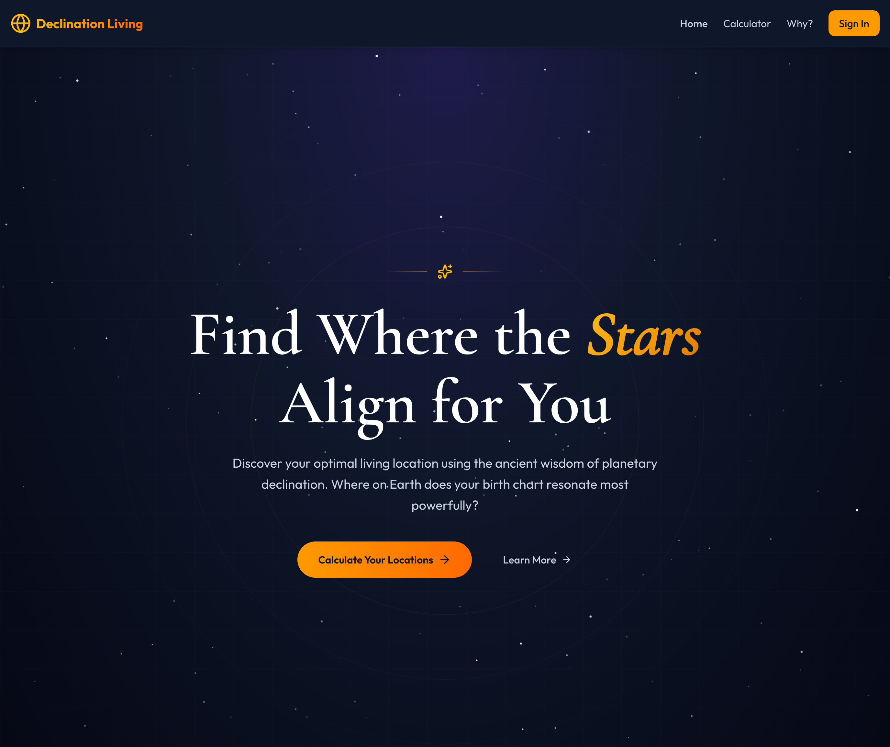

# Declination Living

Declination Living is an astrology-based location app that maps planetary declinations to Earth latitudes and visualizes relocation signals on a 3D globe.



## What The App Does

- Calculates natal declinations from birth date/time/timezone
- Scores latitude fit using weighted planetary preferences
- Generates ACG lines, zenith bands, paran data, and scoring grids
- Ranks candidate cities by combined astrological score
- Saves charts and supports shareable chart links

## Current Product State

Implemented and active:

- Core calculator flow (`/calculator`) with progressive visualization loading
- Enhanced custom Three.js globe with layered rendering (zenith, ACG, parans, heatmap, city markers)
- Chart storage and sharing primitives (dashboard, save, share slug)

Known limitations (as of February 22, 2026):

- Saved chart route (`/results/$chartId`) still has TODO placeholders for full ACG and ranked-city wiring.
- Shared chart route (`/chart/$slug`) uses a legacy lightweight globe path with derived/mock summary visuals rather than the full enhanced pipeline.

## Tech Stack

| Layer | Technology |
| --- | --- |
| Frontend | TanStack Start (React 19 + Vite) |
| Routing | TanStack Router (file-based routes) |
| Backend | Convex (database + functions) |
| Styling | Tailwind CSS v4 + shadcn/ui |
| 3D Visualization | Custom Three.js scene/layer/shader stack |
| Astronomy | astronomia + sweph-wasm integration path |
| Auth | Convex Auth |
| Animation | Framer Motion |

## Key Paths

- Frontend routes: `src/routes/`
- Globe implementation: `src/components/globe/`
- Results layout: `src/components/results/`
- Calculations: `convex/calculations/`
- Charts/cache APIs: `convex/charts/`, `convex/cache/`

## Development

### Prerequisites

- Bun
- Convex account

### Install

```bash
bun install
npx convex init
```

### Run

```bash
# Terminal 1
bun run dev

# Terminal 2
npx convex dev
```

### Validate

```bash
bun run typecheck
bun run test
bun run build
```

## Commands

| Command | Description |
| --- | --- |
| `bun run dev` | Start frontend on port 3000 |
| `npx convex dev` | Start Convex backend |
| `bun run test` | Run tests |
| `bun run typecheck` | Type-check project |
| `bun run build` | Production build |
| `bun run docs:check` | Validate markdown file-path references |

## License

MIT
